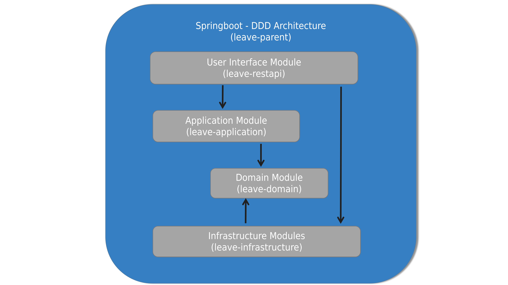

[](https://github.com/codingapi/springboot-framework/blob/main/LICENSE)
[](https://search.maven.org/search?q=g:%22com.codingapi.springboot%22%20AND%20a:%22springboot-starter%22)
[](https://app.travis-ci.com/codingapi/springboot-framework)
[](https://codecov.io/gh/codingapi/springboot-framework)

# springboot-framework | Springboot领域驱动开发

> 当你无意间推开这一扇门，将会感叹原来生活可以如此的美好。

本框架基于springboot为提供领域驱动设计与事件风暴开发落地，提供的范式开源框架。

## Project Modules Description | 项目模块介绍

* springboot-starter | Springboot领域驱动框架
* springboot-starter-data-fast | 快速数据呈现框架
* springboot-starter-id-generator | Id自增策略框架
* springboot-starter-security-jwt | security&jwt权限框架

## SpringBoot DDD Architecture | SpringBoot DDD 框架图



## maven install

```
    <!-- Springboot领域驱动框架 -->
    <dependency>
        <groupId>com.codingapi.springboot</groupId>
        <artifactId>springboot-starter</artifactId>
        <version>${last.version}</version>
    </dependency>
    
     <!-- 快速数据呈现框架 -->
     <dependency>
        <groupId>com.codingapi.springboot</groupId>
        <artifactId>springboot-starter-data-fast</artifactId>
        <version>${last.version}</version>
    </dependency>
    
     <!-- Id自增策略框架 -->
    <dependency>
        <groupId>com.codingapi.springboot</groupId>
        <artifactId>springboot-starter-id-generator</artifactId>
        <version>${last.version}</version>
    </dependency>
    
     <!-- security&jwt权限框架 -->
     <dependency>
        <groupId>com.codingapi.springboot</groupId>
        <artifactId>springboot-starter-security-jwt</artifactId>
        <version>${last.version}</version>
     </dependency>
     
```

## CONTRIBUTING

Welcome to springboot-framework ! This document is a guideline about how to contribute to springboot-framework.
If you find something incorrect or missing, please leave comments / suggestions.

[CONTRIBUTING](./CONTRIBUTING.md)

## Documentation

https://github.com/codingapi/springboot-framework/wiki

## Example

见 [springboot-example](https://github.com/codingapi/springboot-example) 

## Reference Documentation

For further reference, please consider the following sections:

* [Official Apache Maven documentation](https://maven.apache.org/guides/index.html)
* [Spring Boot Maven Plugin Reference Guide](https://docs.spring.io/spring-boot/docs/2.7.1/maven-plugin/reference/html/)
* [Create an OCI image](https://docs.spring.io/spring-boot/docs/2.7.1/maven-plugin/reference/html/#build-image)
* [Spring Security](https://docs.spring.io/spring-boot/docs/2.7.1/reference/htmlsingle/#web.security)
* [Spring Configuration Processor](https://docs.spring.io/spring-boot/docs/2.7.1/reference/htmlsingle/#appendix.configuration-metadata.annotation-processor)
* [Spring Web](https://docs.spring.io/spring-boot/docs/2.7.1/reference/htmlsingle/#web)
* [securing-web](https://spring.io/guides/gs/securing-web/)
* [spring-security-without-the-websecurityconfigureradapter](https://spring.io/blog/2022/02/21/spring-security-without-the-websecurityconfigureradapter)
* [springboot-security&jwt](https://blog.csdn.net/u014553029/article/details/112759382)
* [Meituan-Dianping/Leaf](https://github.com/Meituan-Dianping/Leaf)
* [SpringBoot Test](https://spring.io/guides/gs/testing-web/)
* [SpringBoot Web Test](https://spring.io/guides/gs/testing-web/)  
