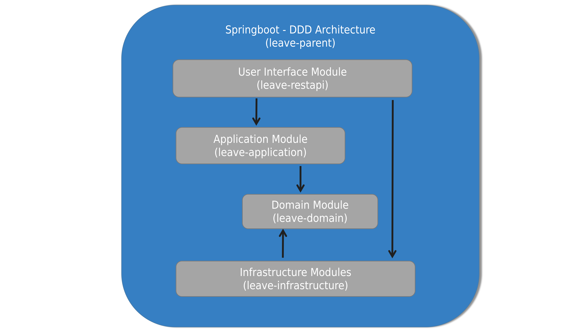

[](https://github.com/codingapi/springboot-framework/blob/main/LICENSE)
[](https://search.maven.org/search?q=g:%22com.codingapi.springboot%22%20AND%20a:%22springboot-starter%22)
[](https://github.com/codingapi/springboot-framework/actions)
[](https://codecov.io/gh/codingapi/springboot-framework)

# springboot-framework | Spring Boot 领域驱动开发框架

> 当你无意间推开这一扇门，将会感叹原来生活可以如此的美好。

springboot-framework 是基于 Spring Boot 的领域驱动设计（DDD）与事件风暴落地框架，提供统一响应封装、动态分页查询、领域事件、数据权限、脚本引擎、认证授权等开箱即用能力。

## 版本说明 | Versions

项目当前维护两条版本线：

| 版本线 | 最低 JDK 要求 | Spring Boot 版本 | 开发版本号 |
|--------|--------------|------------------|-----------|
| [17.3.x](https://github.com/codingapi/springboot-framework/tree/17.3.x) | JDK 17 | Spring Boot 3.x | `17.3.0-SNAPSHOT` |
| [8.2.x](https://github.com/codingapi/springboot-framework/tree/8.2.x) | JDK 8 | Spring Boot 2.x | `8.2.0-SNAPSHOT` |

版本号含义：第一位为最低 JDK 版本，第二位为 Spring Boot 大版本，第三位为补丁版本。项目采用 Maven `${revision}` CI-Friendly 版本机制，正式发布时通过 `-Drevision=x.y.z` 指定版本号，无需修改 pom。

Version lines: **17.3.x** requires JDK 17+ and Spring Boot 3.x; **8.2.x** requires JDK 8+ and Spring Boot 2.x.

## 核心模块 | Modules

| 模块 | 说明 |
|------|------|
| `springboot-starter` | DDD 核心：统一响应封装、动态分页查询、领域事件系统、国际化异常、事务管理 |
| `springboot-starter-script` | Groovy 脚本引擎（运行时编译、缓存、热更新、REST API） |
| `springboot-starter-data-fast` | JPA 增强，动态过滤查询与 HQL 构建 |
| `springboot-starter-data-authorization` | 数据权限，SQL 拦截透明注入行级/列级权限条件 |
| `springboot-starter-security` | JWT 无状态认证 / Redis 有状态认证 |

> 仓库中的 `example`（DDD 示例后端）与 `frontend`（前端示例 monorepo）均为**示例工程**，不属于框架核心内容，仅供学习参考。前端 UI 组件库由独立仓库 [ui-compoments](https://github.com/codingapi/ui-compoments) 维护，与本项目无关。

## 快速开始 | Getting Started

Maven 引入（以正式发布版本为例，最新版本见上方 Maven Central 徽章；开发快照请使用 `17.3.0-SNAPSHOT`）：

```xml
<!-- Spring Boot 领域驱动框架 -->
<dependency>
    <groupId>com.codingapi.springboot</groupId>
    <artifactId>springboot-starter</artifactId>
    <version>17.3.0</version>
</dependency>

<!-- 脚本引擎框架 -->
<dependency>
    <groupId>com.codingapi.springboot</groupId>
    <artifactId>springboot-starter-script</artifactId>
    <version>17.3.0</version>
</dependency>

<!-- 快速数据呈现框架 -->
<dependency>
    <groupId>com.codingapi.springboot</groupId>
    <artifactId>springboot-starter-data-fast</artifactId>
    <version>17.3.0</version>
</dependency>

<!-- 数据权限框架 -->
<dependency>
    <groupId>com.codingapi.springboot</groupId>
    <artifactId>springboot-starter-data-authorization</artifactId>
    <version>17.3.0</version>
</dependency>

<!-- security & jwt 权限框架 -->
<dependency>
    <groupId>com.codingapi.springboot</groupId>
    <artifactId>springboot-starter-security</artifactId>
    <version>17.3.0</version>
</dependency>
```

## SpringBoot DDD Architecture | 框架结构图



## 示例工程 | Example

示例工程的运行与使用见 [示例工程手册](./docs/example-guide.md)。

## 文档 | Documentation

* [Wiki](https://github.com/codingapi/springboot-framework/wiki)
* [开发规范](./docs/conventions/index.md)
* [能力清单](./docs/capabilities/index.md)

## 流程引擎迁移说明 | Flow Engine Migration

工作流引擎（springboot-starter-flow）已从本框架移除，重构为独立仓库维护：[codingapi/flow-engine](https://github.com/codingapi/flow-engine)。需要使用流程引擎的项目请改用独立仓库。

The workflow engine (springboot-starter-flow) has been moved to a standalone repository: [codingapi/flow-engine](https://github.com/codingapi/flow-engine).

## 贡献 | Contributing

详见 [CONTRIBUTING](./CONTRIBUTING.md)。
